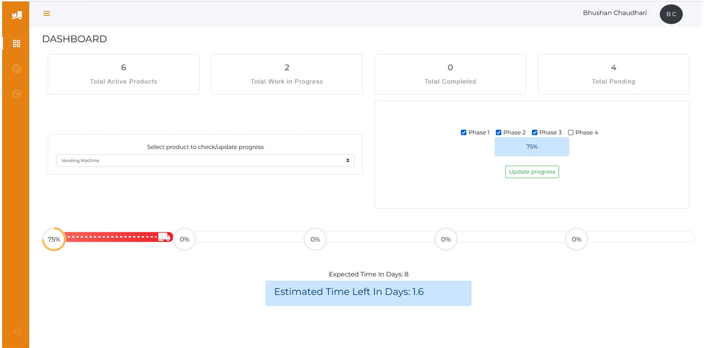
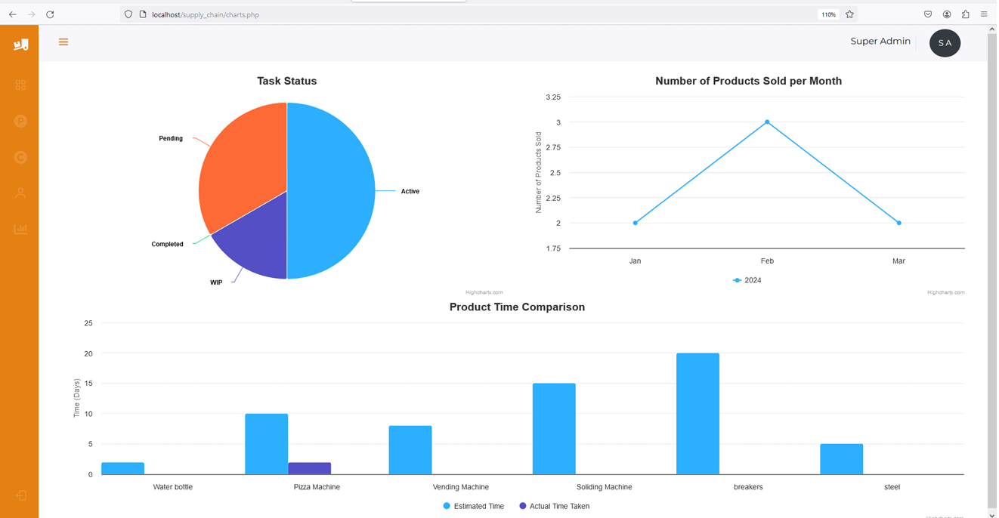
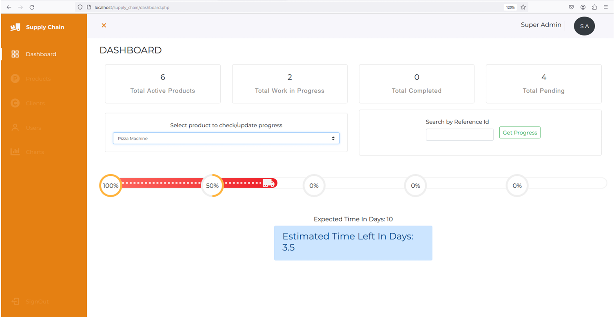
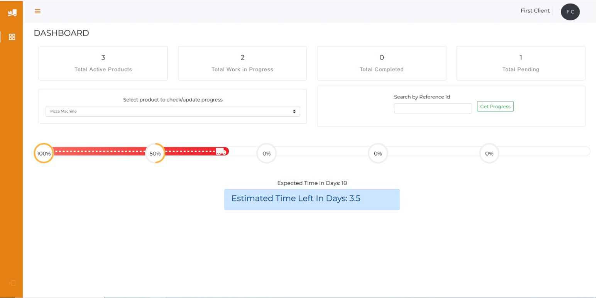

# 📦 Inter-Departmental Supply Chain Management

A centralized web-based platform designed to streamline communication and coordination across departments in a manufacturing supply chain. Built for real-time tracking, transparency, and data-driven decision-making — based on a pilot program with ABB India Limited.

---


## 🧠 Features

- 🔐 **Role-based login system** (Super Admin, Department Admins, Clients)
- 📊 **Real-time dashboards** with:
  - Pie charts for task status
  - Line charts for monthly sales
  - Bar charts for actual vs. estimated completion
- 🔁 **Inter-departmental task tracking**
- 📥 **Client-side product tracking**
- 📣 **Notifications and progress reports**
- 💾 MySQL-backed database with PHP APIs

---

## 🖼️ Screenshots

| Department Admin | Admin (Primary) |
|------------------|------------------|
|  |  |

| Admin (Secondary) | Client Dashboard |
|-------------------|------------------|
|  |  |

> 💡 Add your real screenshots under `assets/screenshots/` and update filenames accordingly

---

## 🛠️ Tech Stack

- **Frontend**: HTML, CSS, JS, Bootstrap 4
- **Backend**: PHP (MVC), jQuery
- **Database**: MySQL
- **Visualization**: DataGraph / Highcharts
- **Dev Tools**: VS Code, XAMPP, Git

---

## 🏗️ System Architecture

- **Super Admin Panel** – centralized overview
- **Department Panels** – monitor & update task progress
- **Client Portal** – see product status
- **Database** – product, task, user, client & sales tables

---

## 📂 Project Structure

```bash
├── index.php
├── dashboard.php
├── adders/
├── assets/
│   ├── css/
│   ├── js/
│   ├── plugin/
│   └── screenshots/
├── config/
├── controller/
├── supply_chain.sql
└── README.md
```

---

## 💡 Project Motivation

> This project was born out of a real-world pilot program in partnership with **ABB India Limited**, aiming to improve transparency and data integrity within departmental supply chains. It emphasizes digital transformation, operational efficiency, and sustainability in enterprise workflows.

---

## 📈 Future Enhancements

- ✅ Blockchain-based audit trails
- ✅ Mobile support
- ✅ Export analytics to Excel/PDF
- ✅ AI-powered predictive timelines

---

